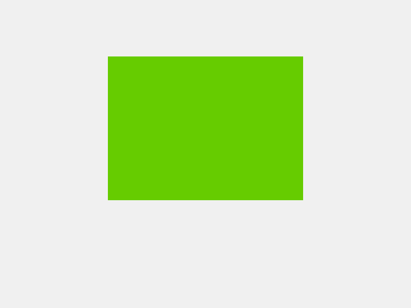
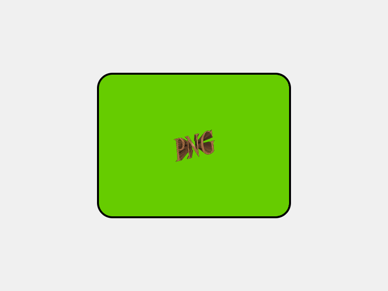
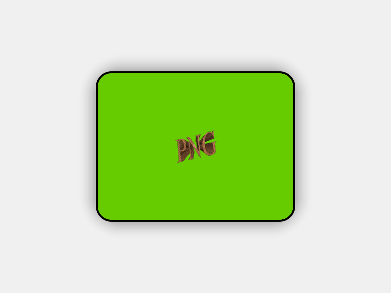

# 绘制复杂的图形

### 绘制背景

LCUI 将组件的背景绘制参数抽象成了 `LCUI_Background` 结构体类型的对象，并由 `Background_Paint()` 进行绘制。

现在就使用它在指定区域内填充绿色作为背景色：

```c
#include <LCUI.h>
#include <LCUI/graph.h>
#include <LCUI/image.h>
#include <LCUI/painter.h>

int main(void)
{
        LCUI_Graph canvas;
        LCUI_Color gray = RGB(240, 240, 240);
        LCUI_Color green = RGB(102, 204, 0);
        LCUI_Rect rect = { 200, 100, 400, 300 };
        LCUI_Background bg = { 0 };
        LCUI_PaintContext paint;

        Graph_Init(&canvas);
        Graph_Create(&canvas, 800, 600);
        Graph_FillRect(&canvas, gray, NULL, FALSE);
        // 设置背景色
        bg.color = green;
        // 创建绘制上下文
        paint = LCUIPainter_Begin(&canvas, &rect);
        // 绘制背景
        Background_Paint(&bg, &rect, paint);
        LCUI_WritePNGFile("test_paint_background_color.png", &canvas);
        LCUIPainter_End(paint);
        Graph_Free(&canvas);
        return 0;
}

```

示例中将画布中的区域 `(200, 100, 400, 30)` 作为背景区域，由于我们要让背景区域被完整绘制出来，所以又将该区域作为绘制区域。需要注意的是，背景区域和绘制都共用同一个原点，只有这两个区域相重叠部分才会被绘制出来。

运行结果：



#### 使用背景图

只是填充颜色的话直接用 `Graph_FillRect()` 更简单些，接下来我们在背景区域内添加一张图片：

```c
#include <LCUI.h>
#include <LCUI/graph.h>
#include <LCUI/image.h>
#include <LCUI/painter.h>

int main(void)
{
        LCUI_Graph canvas;
        LCUI_Graph image;
        LCUI_Color gray = RGB(240, 240, 240);
        LCUI_Color green = RGB(102, 204, 0);
        LCUI_Rect rect = { 200, 100, 400, 300 };
        LCUI_Background bg = { 0 };
        LCUI_PaintContext paint;

        Graph_Init(&canvas);
        Graph_Init(&image);
        Graph_Create(&canvas, 800, 600);
        Graph_FillRect(&canvas, gray, NULL, FALSE);
        // 读取背景图片
        if (LCUI_ReadImageFile("test_image_reader.png", &image) != 0) {
                return -1;
        }
        // 设置背景色
        bg.color = green;
        // 设置背景图
        bg.image = &image;
        bg.size.width = image.width;
        bg.size.height = image.height;
        // 创建绘制上下文
        paint = LCUIPainter_Begin(&canvas, &rect);
        // 绘制背景
        Background_Paint(&bg, &rect, paint);
        LCUI_WritePNGFile("test_paint_background_image.png", &canvas);
        LCUIPainter_End(paint);
        Graph_Free(&image);
        Graph_Free(&canvas);
        return 0;
}
```


#### 拉伸背景图

当背景图的尺寸与背景区域尺寸不同时，我们可以通过设置宽高属性来让背景图填满背景区域：

```c
#include <LCUI.h>
#include <LCUI/graph.h>
#include <LCUI/image.h>
#include <LCUI/painter.h>

int main(void)
{
        LCUI_Graph canvas;
        LCUI_Graph image;
        LCUI_Color gray = RGB(240, 240, 240);
        LCUI_Color green = RGB(102, 204, 0);
        LCUI_Rect rect = { 200, 100, 400, 300 };
        LCUI_Background bg = { 0 };
        LCUI_PaintContext paint;

        Graph_Init(&canvas);
        Graph_Init(&image);
        Graph_Create(&canvas, 800, 600);
        Graph_FillRect(&canvas, gray, NULL, FALSE);
        // 读取背景图片
        if (LCUI_ReadImageFile("test_image_reader.png", &image) != 0) {
                return -1;
        }
        // 设置背景色
        bg.color = green;
        // 设置背景图
        bg.image = &image;
        // 将背景图设置成与背景区域相同的尺寸
        bg.size.width = rect.width;
        bg.size.height = rect.height;
        // 创建绘制上下文
        paint = LCUIPainter_Begin(&canvas, &rect);
        // 绘制背景
        Background_Paint(&bg, &rect, paint);
        LCUI_WritePNGFile("test_paint_background_image_with_size.png", &canvas);
        LCUIPainter_End(paint);
        Graph_Free(&image);
        Graph_Free(&canvas);
        return 0;
}

```


#### 设置背景图位置

```c
#include <LCUI.h>
#include <LCUI/graph.h>
#include <LCUI/image.h>
#include <LCUI/painter.h>

int main(void)
{
        LCUI_Graph canvas;
        LCUI_Graph image;
        LCUI_Color gray = RGB(240, 240, 240);
        LCUI_Color green = RGB(102, 204, 0);
        LCUI_Rect rect = { 200, 100, 400, 300 };
        LCUI_Background bg = { 0 };
        LCUI_PaintContext paint;

        Graph_Init(&canvas);
        Graph_Init(&image);
        Graph_Create(&canvas, 800, 600);
        Graph_FillRect(&canvas, gray, NULL, FALSE);
        // 读取背景图片
        if (LCUI_ReadImageFile("test_image_reader.png", &image) != 0) {
                return -1;
        }
        // 设置背景色
        bg.color = green;
        // 设置背景图
        bg.image = &image;
        bg.size.width = image.width;
        bg.size.height = image.height;
        // 让背景图居中
        bg.position.x = (rect.width - image.width) / 2;
        bg.position.y = (rect.height - image.height) / 2;
        // 创建绘制上下文
        paint = LCUIPainter_Begin(&canvas, &rect);
        // 绘制背景
        Background_Paint(&bg, &rect, paint);
        LCUI_WritePNGFile("test_paint_background_image_with_position.png",
                          &canvas);
        LCUIPainter_End(paint);
        Graph_Free(&image);
        Graph_Free(&canvas);
        return 0;
}

```


### 绘制边框

```c
#include <LCUI.h>
#include <LCUI/graph.h>
#include <LCUI/image.h>
#include <LCUI/painter.h>

int paint_background(LCUI_PaintContext paint, LCUI_Rect *box)
{
        LCUI_Graph image;
        LCUI_Color green = RGB(102, 204, 0);
        LCUI_Background bg = { 0 };

        Graph_Init(&image);
        // 读取背景图片
        if (LCUI_ReadImageFile("test_image_reader.png", &image) != 0) {
                return -1;
        }
        // 设置背景色
        bg.color = green;
        // 设置背景图
        bg.image = &image;
        bg.size.width = image.width;
        bg.size.height = image.height;
        // 让背景图居中
        bg.position.x = (box->width - image.width) / 2;
        bg.position.y = (box->height - image.height) / 2;
        // 绘制背景
        Background_Paint(&bg, box, paint);
        Graph_Free(&image);
        return 0;
}

void paint_border(LCUI_PaintContext paint, LCUI_Rect *box)
{
        LCUI_Border border = { 0 };
        LCUI_Color black = RGB(0, 0, 0);

        border.top.color = black;
        border.top.style = SV_SOLID;
        border.top.width = 4;
        border.right.color = black;
        border.right.style = SV_SOLID;
        border.right.width = 4;
        border.bottom.color = black;
        border.bottom.style = SV_SOLID;
        border.bottom.width = 4;
        border.left.color = black;
        border.left.style = SV_SOLID;
        border.left.width = 4;
        border.top_left_radius = 32;
        border.top_right_radius = 32;
        border.bottom_left_radius = 32;
        border.bottom_right_radius = 32;
        Border_Paint(&border, box, paint);
}

int main(void)
{
        int border_size = 4;

        LCUI_Graph canvas;
        LCUI_Graph layer;
        LCUI_Color gray = RGB(240, 240, 240);
        LCUI_Rect border_box = { 0, 0, 400, 300 };
        LCUI_Rect bg_box = { border_box.x + border_size,
                             border_box.y + border_size,
                             border_box.width - border_size * 2,
                             border_box.height - border_size * 2 };
        LCUI_Rect layer_rect = { 0, 0, border_box.width, border_box.height };
        LCUI_PaintContext paint;

        Graph_Init(&canvas);
        Graph_Create(&canvas, 800, 600);
        Graph_FillRect(&canvas, gray, NULL, FALSE);

        Graph_Init(&layer);
        layer.color_type = LCUI_COLOR_TYPE_ARGB;
        Graph_Create(&layer, layer_rect.width, layer_rect.height);

        // 创建绘制上下文
        paint = LCUIPainter_Begin(&layer, &layer_rect);
        paint->with_alpha = TRUE;
        paint_background(paint, &bg_box);
        paint_border(paint, &border_box);
        Graph_Mix(&canvas, &layer, (canvas.width - layer_rect.width) / 2,
                  (canvas.height - layer_rect.height) / 2, FALSE);
        LCUI_WritePNGFile("test_paint_border.png", &canvas);
        Graph_Free(&canvas);
        return 0;
}

```



### 绘制阴影

```c
#include <LCUI.h>
#include <LCUI/graph.h>
#include <LCUI/image.h>
#include <LCUI/painter.h>

int paint_background(LCUI_PaintContext paint, LCUI_Rect *box)
{
        LCUI_Graph image;
        LCUI_Color green = RGB(102, 204, 0);
        LCUI_Background bg = { 0 };

        Graph_Init(&image);
        // 读取背景图片
        if (LCUI_ReadImageFile("test_image_reader.png", &image) != 0) {
                return -1;
        }
        // 设置背景色
        bg.color = green;
        // 设置背景图
        bg.image = &image;
        bg.size.width = image.width;
        bg.size.height = image.height;
        // 让背景图居中
        bg.position.x = (box->width - image.width) / 2;
        bg.position.y = (box->height - image.height) / 2;
        // 绘制背景
        Background_Paint(&bg, box, paint);
        Graph_Free(&image);
        return 0;
}

void paint_border(LCUI_PaintContext paint, LCUI_Rect *box, int size, int radius)
{
        LCUI_Border border = { 0 };
        LCUI_Color black = RGB(0, 0, 0);

        border.top.color = black;
        border.top.style = SV_SOLID;
        border.top.width = size;
        border.right.color = black;
        border.right.style = SV_SOLID;
        border.right.width = size;
        border.bottom.color = black;
        border.bottom.style = SV_SOLID;
        border.bottom.width = size;
        border.left.color = black;
        border.left.style = SV_SOLID;
        border.left.width = size;
        border.top_left_radius = radius;
        border.top_right_radius = radius;
        border.bottom_left_radius = radius;
        border.bottom_right_radius = radius;
        Border_Paint(&border, box, paint);
}

int main(void)
{
        int border_size = 4;
        int border_radius = 32;
        int width = 800;
        int height = 600;

        LCUI_Graph canvas;
        LCUI_Graph layer;
        LCUI_Color gray = RGB(240, 240, 240);
        LCUI_BoxShadow shadow = { .x = 0,
                                  .y = 0,
                                  .blur = 40,
                                  .spread = 0,
                                  .color = ARGB(150, 0, 0, 0),
                                  .top_left_radius = border_radius,
                                  .top_right_radius = border_radius,
                                  .bottom_left_radius = border_radius,
                                  .bottom_right_radius = border_radius };
        LCUI_Rect shadow_box;
        LCUI_Rect border_box;
        LCUI_Rect bg_box;
        LCUI_Rect layer_rect;
        LCUI_PaintContext paint;

        Graph_Init(&canvas);
        Graph_Create(&canvas, width, height);
        Graph_FillRect(&canvas, gray, NULL, FALSE);

        // 设置居中的背景区域
        bg_box.width = 400;
        bg_box.height = 300;
        bg_box.x = (width - bg_box.width) / 2;
        bg_box.y = (height - bg_box.height) / 2;
        // 基于背景区域，计算边框区域
        border_box.x = bg_box.x - border_size;
        border_box.y = bg_box.y - border_size;
        border_box.width = bg_box.width + border_size * 2;
        border_box.height = bg_box.height + border_size * 2;
        // 基于边框区域，计算阴影区域
        BoxShadow_GetCanvasRect(&shadow, &border_box, &shadow_box);

        // 创建一个临时绘制层
        Graph_Init(&layer);
        layer_rect.x = 0;
        layer_rect.y = 0;
        layer_rect.width = shadow_box.width;
        layer_rect.height = shadow_box.height;
        layer.color_type = LCUI_COLOR_TYPE_ARGB;
        Graph_Create(&layer, layer_rect.width, layer_rect.height);

        // 基于临时绘制层创建绘制上下文
        paint = LCUIPainter_Begin(&layer, &layer_rect);
        paint->with_alpha = TRUE;
        // 将背景区域和边框区域的坐标转换成相对于阴影区域
        bg_box.x -= shadow_box.x;
        bg_box.y -= shadow_box.y;
        border_box.x -= shadow_box.x;
        border_box.y -= shadow_box.y;
        paint_background(paint, &bg_box);
        paint_border(paint, &border_box, border_size, border_radius);
        BoxShadow_Paint(&shadow, &layer_rect, border_box.width,
                        border_box.height, paint);

        // 将临时绘制层混合到画布中
        Graph_Mix(&canvas, &layer, shadow_box.x, shadow_box.y, FALSE);
        LCUI_WritePNGFile("test_paint_boxshadow.png", &canvas);
        Graph_Free(&canvas);
        return 0;
}

```



### 待办事项

**添加样式转绘制参数的函数**

从上面的绘制背景图的示例代码中我们可以看出像位置、尺寸这类参数都要我们编写代码去计算，要是能用 css 代码描述的话会方便很多，因此，我们需要一个函数能够读取样式表中的 `background-` 开头的属性然后输出成`LCUI_Background` 类型的对象。

